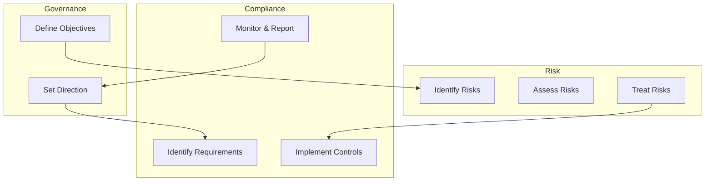

# GRC Model

```mermaid
graph TD
    subgraph Governance
        A[Define Objectives]
        B[Set Direction]
    end
    subgraph Risk
        C[Identify Risks]
        D[Assess Risks]
        E[Treat Risks]
    end
    subgraph Compliance
        F[Identify Requirements]
        G[Implement Controls]
        H[Monitor & Report]
    end
    A --> C;
    B --> F;
    E --> G;
    H --> B;
```
