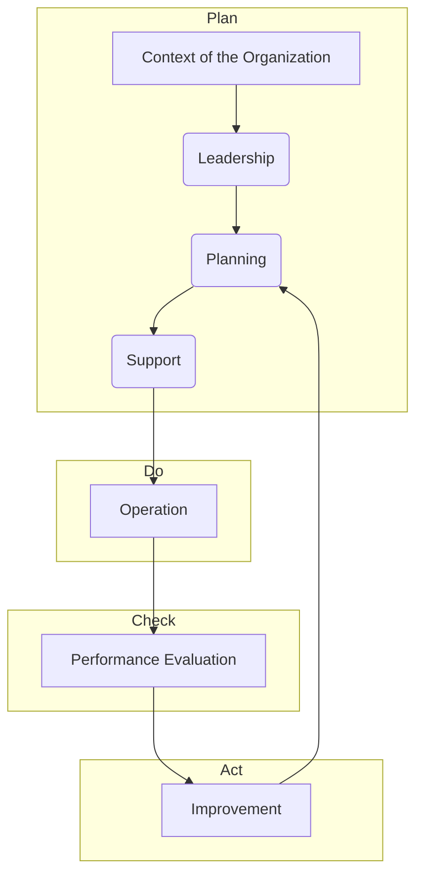

# ISO 27001 ISMS

```mermaid
graph TD
    subgraph Plan
        A[Context of the Organization] --> B(Leadership);
        B --> C(Planning);
        C --> D(Support);
    end
    subgraph Do
        E[Operation]
    end
    subgraph Check
        F[Performance Evaluation]
    end
    subgraph Act
        G[Improvement]
    end
    D --> E;
    E --> F;
    F --> G;
    G --> C;
```
