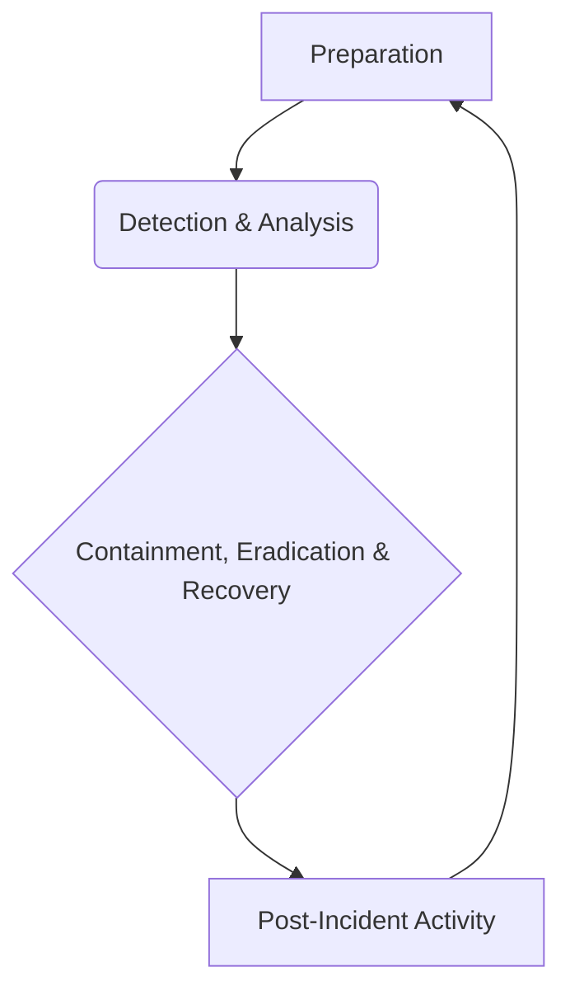

# Incident Response Lifecycle

```mermaid
graph TD
    A[Preparation] --> B(Detection & Analysis);
    B --> C{Containment, Eradication & Recovery};
    C --> D[Post-Incident Activity];
    D --> A;
```
