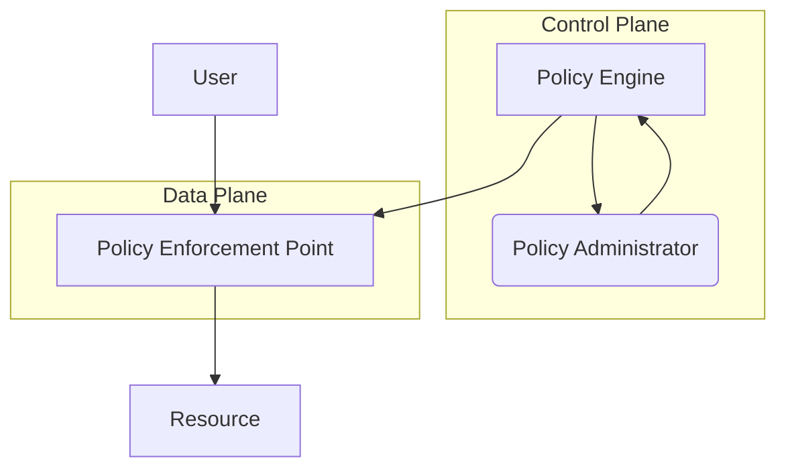

# Zero Trust Architecture

```mermaid
graph TD
    subgraph "Control Plane"
        A[Policy Engine] --> B(Policy Administrator);
        B --> A;
    end
    subgraph "Data Plane"
        C[Policy Enforcement Point]
    end
    A --> C;
    D[User] --> C;
    C --> E[Resource];
```
