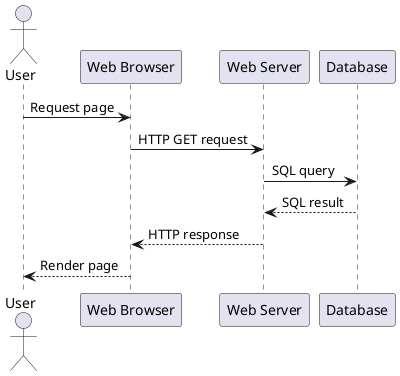
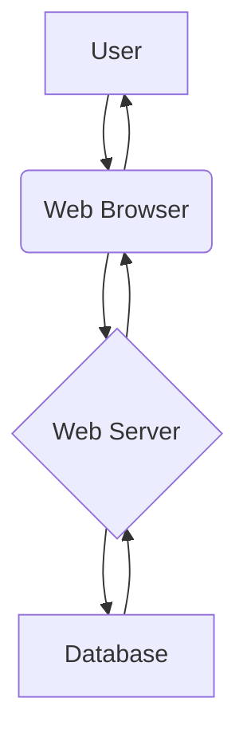

# Architecture Diagramming Tools Guide

## Introduction

Architecture diagrams are essential for visualizing and communicating complex security architectures. This guide provides an overview of some popular architecture diagramming tools.

## PlantUML

**Website:** https://plantuml.com/

**Description:** PlantUML is an open-source tool that allows you to create diagrams from a simple text language. It is great for creating diagrams quickly and for versioning your diagrams in a Git repository.

**Example:**

## Mermaid

**Website:** https://mermaid-js.github.io/mermaid/#/

**Description:** Mermaid is a JavaScript-based diagramming and charting tool that renders Markdown-inspired text definitions to create and modify diagrams dynamically.

**Example:**

## Draw.io (diagrams.net)

**Website:** https://app.diagrams.net/

**Description:** Draw.io is a free, web-based diagramming tool that provides a drag-and-drop interface for creating a wide variety of diagrams, including network diagrams, flowcharts, and UML diagrams.

**Features:**

-   Large library of shapes and icons
-   Integration with Google Drive, OneDrive, and Dropbox
-   Export to various formats (e.g., PNG, SVG, PDF)

## Lucidchart

**Website:** https://www.lucidchart.com/

**Description:** Lucidchart is a commercial, web-based diagramming tool that is popular for its ease of use and collaboration features.

**Features:**

-   Real-time collaboration
-   Large library of templates and shapes
-   Integration with various platforms (e.g., G Suite, Microsoft Office)

## Choosing a Tool

-   **For quick, text-based diagrams that can be versioned in Git:** PlantUML or Mermaid
-   **For a free, web-based tool with a drag-and-drop interface:** Draw.io
-   **For a commercial tool with advanced collaboration features:** Lucidchart
