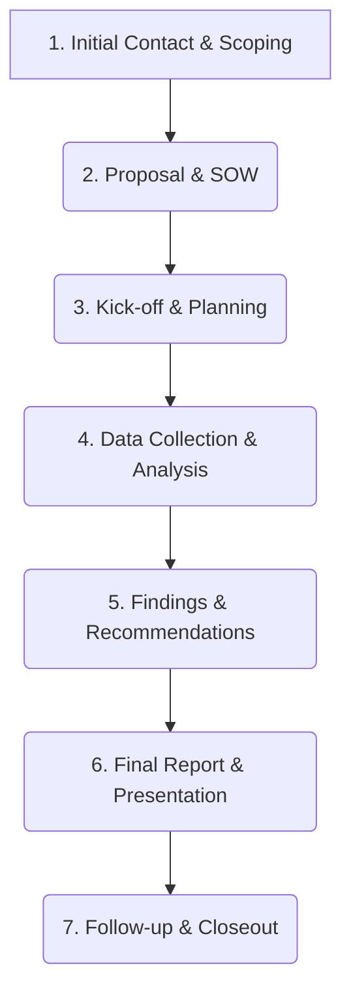

# Consulting Engagement Lifecycle

```mermaid
graph TD
    A[1. Initial Contact & Scoping] --> B(2. Proposal & SOW);
    B --> C(3. Kick-off & Planning);
    C --> D(4. Data Collection & Analysis);
    D --> E(5. Findings & Recommendations);
    E --> F(6. Final Report & Presentation);
    F --> G(7. Follow-up & Closeout);
```
